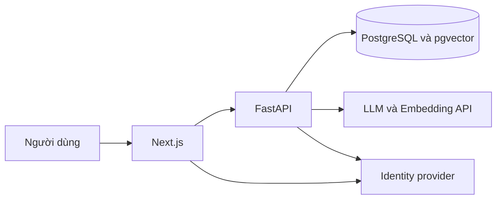

# AI Atlas — Discover, Compare & Build Your AI Stack

> Discover AI. Build your stack.

AI Atlas là nền tảng khám phá AI tools và xây dựng AI stack theo mục tiêu, thiết bị và ngân sách của người dùng. Sản phẩm kết nối một thư viện được biên tập với hệ thống đề xuất có căn cứ, giúp trả lời: có công cụ nào, công cụ nào phù hợp và chúng kết hợp thành quy trình như thế nào?

**Trạng thái ngày 28/09/2026:** chỉ có tài liệu thiết kế. Chưa có ứng dụng, database, migrations, dữ liệu công cụ đã xác minh hay kết quả benchmark. Các chỉ tiêu trong tài liệu là mục tiêu nghiệm thu, không phải số đo thực tế.

## Vấn đề và người dùng

Danh sách liên kết đơn thuần chưa giúp người dùng đánh giá giới hạn, chi phí và khả năng kết hợp công cụ. AI Atlas ưu tiên developers và sinh viên học lập trình/AI; sau MVP có thể mở rộng cho content creators và người làm việc văn phòng.

## MVP dự kiến

- **AI Explorer:** tìm kiếm, lọc và đọc thông tin 100–150 tools được biên tập, có nguồn và ngày kiểm chứng.
- **AI Stack Builder:** chuyển mô tả mục tiêu thành các vai trò cần thiết, chọn tools từ database, giải thích có bằng chứng và trả workflow dạng văn bản.
- **My AI Stack:** đăng nhập, lưu, tạo thủ công, thay thế hoặc xóa tools và truy cập lại stack cá nhân.
- Quản trị dữ liệu bằng quy trình import/validate dành cho maintainer; evaluation và observability cơ bản.

So sánh nâng cao, workflow editor tương tác, multi-agent, scraping diện rộng, thanh toán và social features nằm ngoài MVP. Tên sản phẩm thể hiện cả tầm nhìn dài hạn; Compare chưa phải tính năng đã có.

## Công nghệ và kiến trúc dự kiến

Next.js, TypeScript, Tailwind CSS cho frontend; Python, FastAPI, Pydantic cho backend; PostgreSQL và pgvector cho dữ liệu và retrieval. LLM và embeddings qua API, provider cấu hình được. Docker Compose cho local, GitHub Actions cho CI; Vercel là phương án frontend, backend hosting chưa chốt.

Backend sở hữu business rules, kiểm tra quyền và recommendation validation. Không dùng semantic similarity để kết luận compatibility. Không cần local LLM, Redis, Kafka hay Kubernetes trong MVP.

## Đọc tài liệu theo thứ tự

| Thứ tự | Tài liệu | Mục đích |
|---|---|---|
| 1 | [AGENTS.md](AGENTS.md) | Quy tắc làm việc và nguồn sự thật |
| 2 | [PRD](docs/product/PRD.md) | Yêu cầu và tiêu chí nghiệm thu |
| 3 | [User flows](docs/product/USER_FLOWS.md) | Hành trình, trạng thái và lỗi |
| 4 | [System architecture](docs/architecture/SYSTEM_ARCHITECTURE.md) | Thành phần và ranh giới trách nhiệm |
| 5 | [Data model](docs/architecture/DATA_MODEL.md) | Entities, provenance, ownership |
| 6 | [AI recommendation](docs/architecture/AI_RECOMMENDATION.md) | Retrieval, grounding và evaluation |
| 7 | [API design](docs/architecture/API_DESIGN.md) | Hợp đồng frontend/backend |
| 8 | [Decisions](docs/planning/DECISIONS.md) | Quyết định đã chấp nhận và đề xuất |
| 9 | [Roadmap](docs/planning/ROADMAP.md) | Mốc triển khai trong 6 tuần |
| 10 | [Tasks](docs/planning/TASKS.md) | Backlog, phụ thuộc và trạng thái |
| 11 | [UI/UX Design](docs/design/UI-UX-Design.md) | Design tokens, màn hình, responsive và interaction states; đọc trước task frontend |

## Lộ trình

Tuần 1 hoàn thành một lát cắt Explorer từ database đến UI; tuần 2 hoàn thiện dữ liệu và retrieval; tuần 3 đưa Stack Builder qua validation; tuần 4 hoàn tất đăng nhập và lưu stack; tuần 5 đánh giá và gia cố; tuần 6 bổ sung dữ liệu, sửa lỗi và thử triển khai. Đây là ước lượng cho một người, có thể giãn theo năng lực và thời gian học.

## Bắt đầu và đóng góp

TASK-001 đã hoàn tất review baseline: Auth0 Free + Google Login, Gemini Developer API và UI English/tiếng Việt; xem [quyết định và cấu hình](docs/planning/BASELINE_REVIEW.md). Task tiếp theo là TASK-002 trong [backlog](docs/planning/TASKS.md), triển khai Gemini adapter thật. Unit/CI cô lập network bằng injected transport; live smoke chỉ chạy có chủ đích với API key và phát sinh chi phí Gemini thật. Repository hiện chưa có lệnh chạy ứng dụng. Không chạy theo hướng dẫn cài đặt giả định. TASK-002 sẽ bổ sung cấu trúc code, version pinning, `.env.example`, lệnh setup/test và topology local đã kiểm tra trên Windows.

Mỗi thay đổi nên giải quyết một task có acceptance criteria, kèm bằng chứng kiểm tra. Cập nhật tài liệu khi thay đổi contract; không đánh dấu Done nếu chưa kiểm chứng. Không commit API keys, token hoặc nội dung riêng tư của người dùng.
