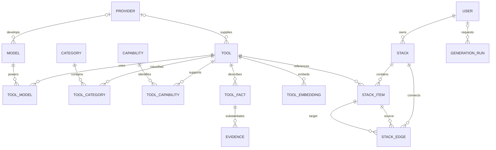

# Data model

Spec logic cho PostgreSQL/pgvector; không phải migration. JSON/API dùng snake_case. UUID do server/curation cấp ổn định; timestamp dùng `timestamptz` UTC. UI đổi timezone khi hiển thị. Quan hệ và schema cần được triển khai, kiểm tra ở TASK-003.

## 1. Entities và quan hệ

Tool là ứng dụng/developer tool; Model là mô hình AI; Provider là tổ chức cung cấp. Một model có thể không có tool tương ứng trong catalog. Một tool có thể dùng nhiều models; provider của tool không nhất thiết là provider của từng model.

Diagram là quan hệ chính; FK owner của stack bắt buộc; run bắt buộc có owner khi tạo, chỉ nullable sau khi xóa tài khoản để giữ accounting đã ẩn danh; provider có thể nullable. Evidence là child của một fact, không phải nguồn chung chứng minh mọi thuộc tính của tool.

## 2. Data dictionary

Mọi bảng entity chính có `id uuid PK`, `created_at`, `updated_at` trừ bảng nối dùng composite PK. Trường không ghi nullable là bắt buộc.

| Bảng | Fields và types quan trọng | Constraints/ý nghĩa |
|---|---|---|
| `providers` | `id`, `name text`, `slug text`, `website_url text?` | unique slug; một tổ chức, không suy ra khả năng tool từ provider |
| `models` | `id`, `provider_id uuid? FK providers`, `name text`, `slug text` | unique slug; chỉ inventory cơ bản, không inference endpoint/model benchmark |
| `categories` | `id`, `name text`, `slug text` | unique slug; 8 nhóm ban đầu |
| `capabilities` | `id`, `key text`, `name text`, `description text` | unique key; controlled vocabulary như `pdf_extraction`, `vector_storage`, `text_generation` |
| `tools` | `id`, `slug text`, `name text`, `description text`, `official_url text`, `provider_id uuid? FK`, `tags text[]`, `publication_status text`, `last_verified_at timestamptz?`, `revision int` | unique slug; status `draft/published/archived`; revision > 0; published cần source/date qua import validator |
| `tool_categories` | `tool_id FK tools`, `category_id FK categories` | composite PK; mỗi published tool ≥ 1 category do importer kiểm tra |
| `tool_models` | `tool_id FK tools`, `model_id FK models` | composite PK; chỉ ghi khi nguồn hỗ trợ quan hệ |
| `tool_capabilities` | `tool_id FK tools`, `capability_id FK capabilities`, `fact_id uuid FK tool_facts` | composite PK; fact phải cùng tool và đúng capability key |
| `tool_facts` | `id`, `tool_id FK tools`, `key text`, `value jsonb`, `verification_status text`, `revision int` | unique `(tool_id,key)`; trạng thái `verified/unverified/unknown`; type của value theo key, kiểm tra tại importer/Pydantic |
| `evidence` | `id`, `fact_id FK tool_facts`, `fact_revision int`, `source_url text`, `source_kind text`, `excerpt text?`, `checked_at timestamptz`, `expires_at timestamptz`, `checked_by text` | `expires_at > checked_at`; source_kind `official_docs/official_pricing/official_site`; excerpt ngắn, không sao chép toàn bộ trang |
| `tool_embeddings` | `tool_id FK tools`, `model_key text`, `content_hash text`, `source_revision int`, `embedding vector(D)`, `embedded_at timestamptz` | PK `(tool_id,model_key)`; D chốt theo provider; không trộn dimensions/model spaces |
| `users` | `id`, `auth_issuer text`, `auth_subject text`, `display_name text?` | unique `(auth_issuer,auth_subject)`; không lưu password; email không bắt buộc |
| `generation_runs` | `id`, `owner_id uuid? FK users`, `result jsonb?`, `status text`, `pipeline_version text`, `catalog_revision text`, `usage jsonb`, `reserved_cost_usd numeric(12,6)`, `estimated_cost_usd numeric(12,6)?`, `expires_at timestamptz`, `request_id uuid` | status `running/complete/partial/no_match/needs_clarification/failed`; result TTL 24h; metadata retention 30 ngày; không raw prompt |
| `stacks` | `id`, `owner_id FK users`, `title varchar(120)`, `purpose varchar(2000)`, `source_generation_id uuid? FK generation_runs`, `generation_snapshot jsonb?`, `validation_state text`, `version int`, `idempotency_key uuid?`, `creation_request_hash text?` | state `generated/manual/modified`; version ≥ 1; unique `(owner_id,idempotency_key)` khi key khác null |
| `stack_items` | `id uuid PK`, `stack_id FK stacks`, `tool_id FK tools`, `role varchar(80)`, `position int`, `rationale text?`, `evidence_ids uuid[]`, `tool_snapshot jsonb` | unique `(stack_id,position)`; position ≥ 1; snapshot từ server; IDs evidence được service validate |
| `stack_edges` | `id uuid PK`, `stack_id FK stacks`, `from_item_id uuid FK`, `to_item_id uuid FK`, `description text`, `compatibility_status text`, `evidence_ids uuid[]` | không self-loop; unique `(stack_id,from_item_id,to_item_id)`; status `verified/unverified`; hai item thuộc cùng stack |

DB enforcement cho edges dùng composite FK `(stack_id,from_item_id)` và `(stack_id,to_item_id)` tới unique `(stack_id,id)` của items. `tool_capabilities` dùng composite FK `(tool_id,fact_id)` tới unique `(tool_id,id)` của facts; importer kiểm tra semantic key. Evidence IDs trong JSON/arrays không được FK tự kiểm tra; service validator bắt buộc, kèm snapshot provenance để chịu được thay đổi dữ liệu.

## 3. Fact vocabulary và metadata filtering

Tránh vừa lưu facts trong JSON vừa có cột cache khác có thể mâu thuẫn. Fact table là nguồn sự thật cho thuộc tính cần verification; projections đọc/API được dựng từ cùng query/service. `null` là chưa biết, `false` chỉ khi có nguồn phủ định rõ ràng.

| Fact key | Dạng value | Quy tắc |
|---|---|---|
| `pricing` | `{model, currency, monthly_min, billing_basis, usage_limits, free_tier}` | model `free/freemium/paid/usage_based/contact/unknown`; số không âm hoặc null; không quy đổi giá chưa có currency/rate |
| `platforms` | Mảng `web/windows/macos/linux/ios/android` hoặc null | “web” nghĩa truy cập trình duyệt, không chứng minh offline Windows |
| `api_available` | boolean hoặc null | Chỉ true + evidence fresh mới thỏa hard API |
| `open_source` | `{status: boolean|null, license: string|null}` | Không đồng nhất open weights với open-source tool |
| `deployment_modes` | Mảng `cloud/local` hoặc null | Local cần facts về hardware nếu có constraint |
| `min_ram_gb` | number hoặc null | Không suy từ size download; source phải mô tả cấu hình phù hợp deployment |
| `offline_supported` | boolean hoặc null | True phải được tài liệu chứng minh; cloud không đáp ứng offline |
| `capability:<key>` | boolean hoặc null | `tool_capabilities` chỉ nối tới fact verified true khi publish capability |
| `integration:<target_key>` | `{target_tool_id: uuid|null, target_name, mechanism, conditions}` | Evidence cùng fact xác minh direction và điều kiện; target có thể là dịch vụ ngoài catalog |

Provider description và official URL phải có evidence fact `identity` chứa name/URL/provider reference. Các liên kết tool-model cần fact `model_usage:<model_slug>`. Tags chỉ hỗ trợ discovery, không là bằng chứng capability.

Pricing budget tổng stack: không cộng `monthly_min` như actual total nếu còn usage-based hoặc limits chưa biết. Hard budget chỉ pass nếu xác định được mọi chi phí bắt buộc cho usage scenario, cùng currency/billing period. Thiếu thông tin → clarification hoặc gap, không pass. MVP chỉ hỗ trợ hard budget USD/tháng và usage scenario đã khai báo; currency khác yêu cầu user chuyển/chấp thuận budget USD, không tự đoán exchange rate.

## 4. Provenance, freshness và lifecycle

Policy thiết kế ban đầu, không phải khẳng định về tốc độ thay đổi thị trường: pricing evidence TTL 30 ngày; capabilities, integrations, platforms, API, hardware, license và identity 90 ngày. Runtime chỉ coi fact verified khi có evidence cùng `fact_revision`, `checked_at <= now < expires_at`; evidence cũ không chứng minh value mới. `last_verified_at` là ngày review record, không thay thế freshness từng fact.

Maintainer đọc nguồn chính thức, ghi exact fact, source URL, thời điểm và người kiểm tra. Không tìm được bằng chứng thì để unknown/unverified. Mâu thuẫn nguồn → unverified, ghi lý do trong curated notes và loại khỏi hard eligibility. Quy trình import: validate schema/FKs/HTTPS sources → dry-run diff → atomic upsert → bump revision nếu content đổi → invalidate embeddings → reindex. Import không tự fetch URL tùy ý; source verification là thao tác biên tập.

Không hard-delete tools/facts đã được tham chiếu; archive tools, giữ UUID. Update fact tăng revision; evidence cũ còn lịch sử nhưng runtime không dùng. Tool archived biến mất khỏi discovery/retrieval, saved stacks vẫn có snapshot và cảnh báo. Xóa stack cascade items/edges; xóa user theo yêu cầu cascade owned stacks, xóa result và bỏ owner của runs (FK SET NULL), chỉ giữ metadata accounting tối thiểu đến hạn purge. Run owner null không được user nào đọc hoặc dùng để save. Purge run metadata đặt `source_generation_id` null; snapshot trên stack vẫn còn. TTL cleanup làm `result=null` sau 24h, không phải xóa stack của user.

## 5. Search và embeddings

- Keyword: weighted tsvector từ name/description/tags/capability labels, dùng cấu hình `simple` ban đầu cho dữ liệu Việt/Anh; thêm name/slug exact match. Chuẩn hóa Unicode tại import/query. Đo retrieval rồi mới chọn tokenizer khác.
- GIN cho search vector; index `(publication_status,slug)`; indexes FK/join và `(tool_facts.key,verification_status,tool_id)`; JSONB indexes chỉ thêm nếu EXPLAIN chứng minh cần thiết.
- Vector document: name, description, category/capability labels đã publish; không nhúng PII hoặc price volatile. `content_hash` và `source_revision` phát hiện embedding stale.
- Catalog nhỏ dùng exact cosine distance, chưa cần HNSW/IVFFlat. Keyword và vector pool sau đó fusion và hard filtering theo [AI spec](AI_RECOMMENDATION.md).
- TASK-001/ADR-012 chốt gemini-embedding-2 với D=1536; request phải đặt output_dimensionality=1536, schema migration pin vector(1536). Đổi provider/dimension cần re-embed trong storage/index mới, backfill rồi cutover; không ghi vector dimension mới vào cột cũ.
- Embedding stale/unavailable bỏ vector hit, dùng keyword và ghi degraded retrieval; tuyệt đối không bỏ metadata filter.

## 6. Stack integrity và quyền sở hữu

Stack items dùng UUID riêng vì một tool có thể đóng nhiều vai trò. Positions liên tục 1..N; edges phải theo thứ tự từ position nhỏ đến lớn để MVP là workflow có hướng không chu trình. Server giới hạn 20 items, 40 edges; mỗi edge cùng stack và có endpoints còn tồn tại.

Generated result lưu snapshot chứa requirements/status/gaps/evidence tại thời điểm sinh; `validation_state=generated` không có nghĩa facts mãi còn đúng. API bổ sung stale/archive warnings khi đọc. Chỉnh items/roles/edges → state modified và xóa evidence liên quan; sửa title/purpose không tự chứng minh stack đáp ứng mục đích mới, đổi purpose cũng chuyển modified. Manual stack là manual cho tới khi có một generation mới.

Update dùng `UPDATE ... WHERE owner_id=? AND version=?` trong transaction, tăng version; không có row matching → phân biệt 404/409 mà không rò ownership. Index `(owner_id,updated_at,id)` phục vụ list; mọi read/update/delete đều scope owner. Mọi normalized snapshot từ server, không tin evidence/rationale/validation_state client gửi.

## 7. Admission accounting

Không thêm quota service riêng trong MVP. `generation_runs.created_at` và owner phục vụ đếm requests theo cửa sổ; thêm index `(owner_id,created_at)` và `(created_at,status)`. Khi admission, transaction khóa user row để kiểm tra quota và tạo run `running`; mọi run đã reserve đều tính vào quota kể cả failed, trừ request bị từ chối trước admission. Với budget toàn hệ thống, dùng một PostgreSQL transaction advisory lock có key cố định cho tháng UTC để kiểm tra tổng settled cost cộng outstanding reservations và ghi reservation atomically. Thứ tự khóa luôn global budget rồi user để tránh deadlock.

Run finished settle actual estimated cost và bỏ reservation trong transaction; request bị hủy/timeout vẫn ghi phần cost đã phát sinh. Cleanup run `running` quá deadline không được giải phóng khoản cost chưa rõ một cách lạc quan: giữ upper-bound như chi phí ước tính cho tới đối soát. Metadata retention 30 ngày phải giữ nguyên các rows còn thuộc tháng budget hiện tại hoặc reservation chưa được đối soát; khi tháng đã đóng mới áp dụng purge. Các chi tiết này cần concurrency tests ở TASK-015, không dựa vào bộ đếm trong memory.
