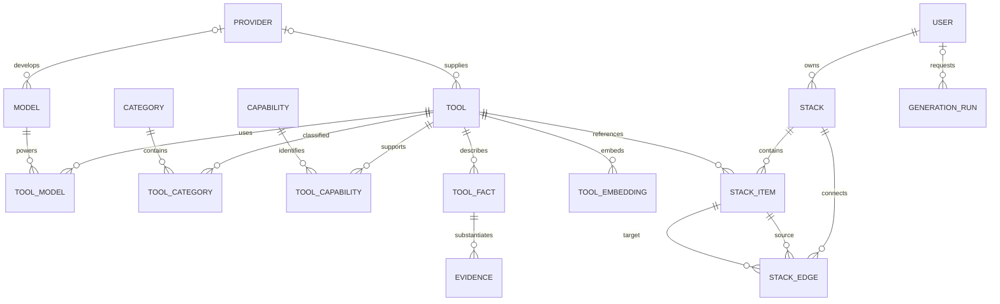

# Data model

Spec logic cho PostgreSQL/pgvector; không phải migration. JSON/API dùng snake_case. UUID do server/curation cấp ổn định; timestamp dùng `timestamptz` UTC. UI đổi timezone khi hiển thị. Quan hệ và schema cần được triển khai, kiểm tra ở TASK-003.

## 1. Entities và quan hệ

Tool là ứng dụng/developer tool; Model là mô hình AI; Provider là tổ chức cung cấp. Một model có thể không có tool tương ứng trong catalog. Một tool có thể dùng nhiều models; provider của tool không nhất thiết là provider của từng model.



Diagram là quan hệ chính; FK owner của stack bắt buộc; run bắt buộc có owner khi tạo, chỉ nullable sau khi xóa tài khoản để giữ accounting đã ẩn danh; provider có thể nullable. Evidence là child của một fact, không phải nguồn chung chứng minh mọi thuộc tính của tool.

## 2. Data dictionary

Mọi bảng entity chính có `id uuid PK`, `created_at`, `updated_at` trừ bảng nối dùng composite PK. Trường không ghi nullable là bắt buộc.

| Bảng | Fields và types quan trọng | Constraints/ý nghĩa |
|---|---|---|
| `providers` | `id`, `name text`, `slug text`, `website_url text?` | unique slug; một tổ chức, không suy ra khả năng tool từ provider |
| `models` | `id`, `provider_id uuid? FK providers`, `name text`, `slug text` | unique slug; chỉ inventory cơ bản, không inference endpoint/model benchmark |
| `categories` | `id`, `name text`, `slug text` | unique slug; 8 nhóm ban đầu |
| `capabilities` | `id`, `key text`, `name text`, `description text` | unique key; controlled vocabulary như `pdf_extraction`, `vector_storage`, `text_generation` |
| `tools` | `id`, `slug text`, `name text`, `description text`, `official_url text`, `provider_id uuid? FK`, `tags text[]`, `publication_status text`, `last_verified_at timestamptz?`, `revision int`, `search_vector tsvector` | unique slug; status `draft/published/archived`; revision > 0; published cần source/date qua import validator; search_vector là projection do importer/server dựng, không nhận từ client |
| `tool_categories` | `tool_id FK tools`, `category_id FK categories` | composite PK; mỗi published tool ≥ 1 category do importer kiểm tra |
| `tool_models` | `tool_id FK tools`, `model_id FK models` | composite PK; chỉ ghi khi nguồn hỗ trợ quan hệ |
| `tool_capabilities` | `tool_id FK tools`, `capability_id FK capabilities`, `fact_id uuid FK tool_facts` | composite PK; fact phải cùng tool và đúng capability key |
| `tool_facts` | `id`, `tool_id FK tools`, `key text`, `value jsonb`, `verification_status text`, `revision int` | unique `(tool_id,key)`; trạng thái `verified/unverified/unknown`; type của value theo key, kiểm tra tại importer/Pydantic |
| `evidence` | `id`, `fact_id FK tool_facts`, `fact_revision int`, `source_url text`, `source_kind text`, `excerpt text?`, `checked_at timestamptz`, `expires_at timestamptz`, `checked_by text` | `expires_at > checked_at`; source_kind `official_docs/official_pricing/official_site`; excerpt ngắn, không sao chép toàn bộ trang |
| `tool_embeddings` | `tool_id FK tools`, `model_key text`, `content_hash text`, `source_revision int`, `embedding vector(D)`, `embedded_at timestamptz` | PK `(tool_id,model_key)`; D chốt theo provider; không trộn dimensions/model spaces |
| `users` | `id`, `auth_issuer text`, `auth_subject text`, `display_name text?` | unique `(auth_issuer,auth_subject)`; không lưu password; email không bắt buộc |
| `generation_runs` | `id`, `owner_id uuid? FK users`, `result jsonb?`, `status text`, `pipeline_version text`, `catalog_revision text`, `usage jsonb`, `reserved_cost_usd numeric(12,6)`, `estimated_cost_usd numeric(12,6)?`, `expires_at timestamptz`, `request_id uuid` | status `running/complete/partial/no_match/needs_clarification/failed`; result TTL 24h; metadata retention 30 ngày; không raw prompt |
| `stacks` | `id`, `owner_id FK users`, `title varchar(120)`, `purpose varchar(2000)`, `source_generation_id uuid? FK generation_runs`, `generation_snapshot jsonb?`, `validation_state text`, `version int`, `idempotency_key uuid?`, `creation_request_hash text?` | state `generated/manual/modified`; version ≥ 1; unique `(owner_id,idempotency_key)` khi key khác null |
| `stack_items` | `id uuid PK`, `stack_id FK stacks`, `tool_id FK tools`, `role varchar(80)`, `position int`, `rationale text?`, `evidence_ids uuid[]`, `tool_snapshot jsonb` | unique `(stack_id,position)`; position ≥ 1; snapshot từ server; IDs evidence được service validate |
| `stack_edges` | `id uuid PK`, `stack_id FK stacks`, `from_item_id uuid FK`, `to_item_id uuid FK`, `description text`, `compatibility_status text`, `evidence_ids uuid[]` | không self-loop; unique `(stack_id,from_item_id,to_item_id)`; status `verified/unverified`; hai item thuộc cùng stack |

DB enforcement cho edges dùng composite FK `(stack_id,from_item_id)` và `(stack_id,to_item_id)` tới unique `(stack_id,id)` của items. `tool_capabilities` dùng composite FK `(tool_id,fact_id)` tới unique `(tool_id,id)` của facts; importer kiểm tra semantic key. Evidence IDs trong JSON/arrays không được FK tự kiểm tra; service validator bắt buộc, kèm snapshot provenance để chịu được thay đổi dữ liệu.

## 3. Fact vocabulary và metadata filtering

Tránh vừa lưu facts trong JSON vừa có cột cache khác có thể mâu thuẫn. Fact table là nguồn sự thật cho thuộc tính cần verification; projections đọc/API được dựng từ cùng query/service. `null` là chưa biết, `false` chỉ khi có nguồn phủ định rõ ràng.

| Fact key | Dạng value | Quy tắc |
|---|---|---|
| `pricing` | `{model, currency, monthly_min, billing_basis, usage_limits, free_tier}` | model `free/freemium/paid/usage_based/contact/unknown`; số không âm hoặc null; không quy đổi giá chưa có currency/rate |
| `platforms` | Mảng `web/windows/macos/linux/ios/android` hoặc null | “web” nghĩa truy cập trình duyệt, không chứng minh offline Windows |
| `api_available` | boolean hoặc null | Chỉ true + evidence fresh mới thỏa hard API |
| `open_source` | `{status: boolean|null, license: string|null}` | Không đồng nhất open weights với open-source tool |
| `deployment_modes` | Mảng `cloud/local` hoặc null | Local cần facts về hardware nếu có constraint |
| `min_ram_gb` | number hoặc null | Không suy từ size download; source phải mô tả cấu hình phù hợp deployment |
| `offline_supported` | boolean hoặc null | True phải được tài liệu chứng minh; cloud không đáp ứng offline |
| `capability:<key>` | boolean hoặc null | `tool_capabilities` chỉ nối tới fact verified true khi publish capability |
| `model_usage:<model_slug>` | boolean hoặc null | Public model relation chỉ hiển thị với verified true + evidence fresh cùng revision; false là nguồn phủ định quan hệ, null là chưa biết |
| `integration:<target_key>` | `{target_tool_id: uuid|null, target_name, mechanism, conditions}` | Evidence cùng fact xác minh direction và điều kiện; target có thể là dịch vụ ngoài catalog |

Provider description và official URL phải có evidence fact `identity` chứa name/URL/provider reference. Các liên kết tool-model cần fact `model_usage:<model_slug>`. Tags chỉ hỗ trợ discovery, không là bằng chứng capability.

Pricing budget tổng stack: không cộng `monthly_min` như actual total nếu còn usage-based hoặc limits chưa biết. Hard budget chỉ pass nếu xác định được mọi chi phí bắt buộc cho usage scenario, cùng currency/billing period. Thiếu thông tin → clarification hoặc gap, không pass. MVP chỉ hỗ trợ hard budget USD/tháng và usage scenario đã khai báo; currency khác yêu cầu user chuyển/chấp thuận budget USD, không tự đoán exchange rate.

## 4. Provenance, freshness và lifecycle

Policy thiết kế ban đầu, không phải khẳng định về tốc độ thay đổi thị trường: pricing evidence TTL 30 ngày; capabilities, integrations, platforms, API, hardware, license và identity 90 ngày. Runtime chỉ coi fact verified khi có evidence cùng `fact_revision`, `checked_at <= now < expires_at`; evidence cũ không chứng minh value mới. `last_verified_at` là ngày review record, không thay thế freshness từng fact.

Maintainer đọc nguồn chính thức, ghi exact fact, source URL, thời điểm và người kiểm tra. Không tìm được bằng chứng thì để unknown/unverified. Mâu thuẫn nguồn → unverified, ghi lý do trong curated notes và loại khỏi hard eligibility. Quy trình import: validate schema/FKs/HTTPS sources → dry-run diff → atomic upsert → bump revision nếu content đổi → invalidate embeddings → reindex. Import không tự fetch URL tùy ý; source verification là thao tác biên tập.

Không hard-delete tools/facts đã được tham chiếu; archive tools, giữ UUID. Update fact tăng revision; evidence cũ còn lịch sử nhưng runtime không dùng. Tool archived biến mất khỏi discovery/retrieval, saved stacks vẫn có snapshot và cảnh báo. Xóa stack cascade items/edges; xóa user theo yêu cầu cascade owned stacks, xóa result và bỏ owner của runs (FK SET NULL), chỉ giữ metadata accounting tối thiểu đến hạn purge. Run owner null không được user nào đọc hoặc dùng để save. Purge run metadata đặt `source_generation_id` null; snapshot trên stack vẫn còn. TTL cleanup làm `result=null` sau 24h, không phải xóa stack của user.

## 5. Search và embeddings

- Keyword: weighted `tools.search_vector` từ name/description/tags/category/capability labels, dùng cấu hình `simple` ban đầu cho dữ liệu Việt/Anh; importer/server phải dựng lại projection trong cùng transaction khi các field/labels đổi; thêm name/slug exact match. Chuẩn hóa Unicode tại import/query. Đo retrieval rồi mới chọn tokenizer khác.
- GIN cho search vector; index `(publication_status,slug)`; indexes FK/join và `(tool_facts.key,verification_status,tool_id)`; JSONB indexes chỉ thêm nếu EXPLAIN chứng minh cần thiết.
- Vector document: name, description, category/capability labels đã publish; không nhúng PII hoặc price volatile. `content_hash` và `source_revision` phát hiện embedding stale.
- Catalog nhỏ dùng exact cosine distance, chưa cần HNSW/IVFFlat. Keyword và vector pool sau đó fusion và hard filtering theo [AI spec](AI_RECOMMENDATION.md).
- TASK-001/ADR-012 chốt gemini-embedding-2 với D=1536; request phải đặt output_dimensionality=1536, schema migration pin vector(1536). Đổi provider/dimension cần re-embed trong storage/index mới, backfill rồi cutover; không ghi vector dimension mới vào cột cũ.
- Embedding stale/unavailable bỏ vector hit, dùng keyword và ghi degraded retrieval; tuyệt đối không bỏ metadata filter.

## 6. Stack integrity và quyền sở hữu

Stack items dùng UUID riêng vì một tool có thể đóng nhiều vai trò. Positions liên tục 1..N; edges phải theo thứ tự từ position nhỏ đến lớn để MVP là workflow có hướng không chu trình. Server giới hạn 20 items, 40 edges; mỗi edge cùng stack và có endpoints còn tồn tại.

Generated result lưu snapshot chứa requirements/status/gaps/evidence tại thời điểm sinh; `validation_state=generated` không có nghĩa facts mãi còn đúng. API bổ sung stale/archive warnings khi đọc. Chỉnh items/roles/edges → state modified và xóa evidence liên quan; sửa title/purpose không tự chứng minh stack đáp ứng mục đích mới, đổi purpose cũng chuyển modified. Manual stack là manual cho tới khi có một generation mới.

Update dùng `UPDATE ... WHERE owner_id=? AND version=?` trong transaction, tăng version; không có row matching → phân biệt 404/409 mà không rò ownership. Index `(owner_id,updated_at,id)` phục vụ list; mọi read/update/delete đều scope owner. Mọi normalized snapshot từ server, không tin evidence/rationale/validation_state client gửi.

## 7. Admission accounting

Không thêm quota service riêng trong MVP. `generation_runs.created_at` và owner phục vụ đếm requests theo cửa sổ; thêm index `(owner_id,created_at)` và `(created_at,status)`. Khi admission, transaction khóa user row để kiểm tra quota và tạo run `running`; mọi run đã reserve đều tính vào quota kể cả failed, trừ request bị từ chối trước admission. Với budget toàn hệ thống, dùng một PostgreSQL transaction advisory lock có key cố định cho tháng UTC để kiểm tra tổng settled cost cộng outstanding reservations và ghi reservation atomically. Thứ tự khóa luôn global budget rồi user để tránh deadlock.

Run finished settle actual estimated cost và bỏ reservation trong transaction; request bị hủy/timeout vẫn ghi phần cost đã phát sinh. Cleanup run `running` quá deadline không được giải phóng khoản cost chưa rõ một cách lạc quan: giữ upper-bound như chi phí ước tính cho tới đối soát. Metadata retention 30 ngày phải giữ nguyên các rows còn thuộc tháng budget hiện tại hoặc reservation chưa được đối soát; khi tháng đã đóng mới áp dụng purge. Các chi tiết này cần concurrency tests ở TASK-015, không dựa vào bộ đếm trong memory.

## 8. Curated JSON format — TASK-005.1

Implementation: [curated_models.py](../../apps/api/src/ai_atlas_api/curated_models.py). Input là JSON UTF-8 không BOM, snake_case, với `schema_version: 1`. Dùng `CuratedCatalog.model_validate_json` tại file boundary; `model_validate` strict trên Python objects yêu cầu UUID/datetime objects đúng type. Có thể lấy JSON Schema bằng `CuratedCatalog.model_json_schema()`; không giữ một bản generated schema thứ hai dễ lệch models.

### Document và entities

Mỗi document có đủ arrays `providers`, `models`, `categories`, `capabilities`, `tools`; arrays có thể rỗng. [taxonomy.json](../../data/curated/taxonomy.json) chứa 8 categories đã chốt trong API contract và 15 capability definitions, không chứa tool/model/provider giả. Đây là vocabulary biên tập, không phải evidence khẳng định khả năng của tool. Các file tools sau này có thể reference UUID trong taxonomy; resolve references trên tập file/DB thuộc 005.2, không phải chức năng của parser 005.1.

| Object | Fields bắt buộc |
|---|---|
| Provider | `id, slug, name, website_url` (URL hoặc null) |
| Model | `id, slug, name, provider_id` (UUID hoặc null) |
| Category | `id, slug, name` |
| Capability definition | `id, key, name, description` |
| Tool | `id, slug, name, description, official_url, provider_id, tags, publication_status, last_verified_at, category_ids, model_ids, capabilities, facts` |
| Tool capability relation | `capability_id, fact_id` |
| Fact | `id, key, value, verification_status, evidence` |
| Evidence trong fact | `id, source_url, source_kind, checked_at, expires_at, checked_by` |

Nullable fields vẫn phải ghi explicit null: tool `provider_id`, `last_verified_at`; mọi nullable field của structured fact values. Chỉ `curation_notes` của tool/fact và `excerpt` của evidence được omitted, mặc định null. Tool `publication_status` bắt buộc là draft/published/archived, không auto-publish. `checked_by` dùng maintainer handle, không cần email/PII.

UUID của entity/fact/evidence do curator cấp một lần, commit và giữ ổn định; đổi name/slug không đổi ID. Taxonomy IDs đã được ghi cố định trong JSON, không generate lại lúc load. Slugs dùng lowercase letters/digits với hyphens; capability keys dùng lowercase letters/digits với underscores. Các text aliases trim và Unicode NFC; enum values phải khớp contract, không tự ép chữ hoa thành chữ thường. Name/tag tối đa 200 chars, description/long text 4000, slug/key 100, excerpt 1000 và curation_notes 2000. URLs dùng HTTPS với tối đa 2048 chars; đây chỉ là kiểm tra hình thức URL, không chứng minh nguồn chính thức và không fetch URL. Timestamps phải có timezone, được chuẩn hóa UTC; không nhận naive dates hoặc numeric epoch.

### Fact values

`CuratedFact` là union theo key: fixed keys và namespace patterns chỉ nhận value schema tương ứng. Tất cả nested objects forbid extra keys và dùng strict types; không ép string `"false"`/number 0 thành boolean. Numeric fields nhận JSON number hữu hạn, không âm; boolean không phải number.

| Key | Value schema |
|---|---|
| pricing | Object hoặc null. Object có đủ `model, currency, monthly_min, billing_basis, usage_limits, free_tier`; model theo enum hiện có; currency là mã 3 chữ hoa hoặc null; monthly_min là number ≥ 0 hoặc null; billing_basis/usage_limits là text hoặc null; free_tier boolean hoặc null |
| platforms | Array platform enum hiện có hoặc null |
| api_available, offline_supported | Boolean hoặc null |
| open_source | `{status: boolean|null, license: string|null}` hoặc null |
| deployment_modes | Array cloud/local hoặc null |
| min_ram_gb | Number ≥ 0 hoặc null |
| identity | `{name, description, official_url, provider_id: UUID|null}` hoặc null |
| capability:&lt;key&gt; | Boolean hoặc null; suffix theo capability key grammar |
| model_usage:&lt;model_slug&gt; | Boolean hoặc null; suffix theo slug grammar |
| integration:&lt;target_key&gt; | `{target_tool_id: UUID|null, target_name, mechanism: string|null, conditions: string[]|null}` hoặc null; target key lowercase letters/digits, phân cách bằng hyphen hoặc underscore |

Theo ADR-010, top-level `value: null` bắt buộc `verification_status: unknown`, và unknown bắt buộc value null. False là phủ định, không phải unknown. Structured values có thể có subfields null: ví dụ pricing model đã biết nhưng usage_limits chưa biết, hoặc open_source.status chưa biết. Những null này không xác nhận miễn phí/false/khả năng đáp ứng hard constraint. `conditions: []` là biết không có điều kiện được ghi; null là chưa biết. Pricing text không tự trở thành cost/rate đã parse; eligibility/budget evaluator vẫn thuộc TASK-009.

Ví dụ fact **synthetic chỉ minh họa format**, không đưa vào curated production data:

```json
{
  "id": "10000000-0000-4000-8000-000000000001",
  "key": "api_available",
  "value": null,
  "verification_status": "unknown",
  "evidence": [],
  "curation_notes": "Chưa có nguồn xác minh API."
}
```

### Metadata do importer quản lý và phạm vi

Facts nằm trong tool; evidence nằm trong fact. Importer sẽ map parent IDs thành `tool_facts.tool_id`, `evidence.fact_id` và assign `evidence.fact_revision` khớp revision của fact được nguồn chứng minh. Không nhận `revision`, `fact_revision`, `search_vector`, timestamps created_at/updated_at hoặc embeddings trong curated input; chúng do importer/database quản lý. Khi nội dung fact đổi, evidence UUID cũ không được tự gắn sang revision mới: giữ lịch sử, curator cung cấp evidence mới sau re-verification; enforce khi đối chiếu DB thuộc 005.2/005.4. Import lặp content không đổi phải giữ IDs/revisions. `last_verified_at` là ngày curator review record, không thay thế dates/TTL từng evidence.

Parser 005.1 chỉ chứng minh type/shape/unknown-null invariant. Semantic validations về source syntax, uniqueness, FK existence, identity agreement, time ordering/TTL/freshness và điều kiện publish đã triển khai ở 005.2, chi tiết tại mục 9; source authenticity vẫn do maintainer xác minh thủ công. CLI dry-run thuộc 005.3, atomic upsert/revisions/reindex thuộc 005.4, seed 15 tools thật thuộc 005.5. Curation notes và excerpts là nội dung private/untrusted, không được thêm vào public API projection hoặc prompt như instructions. Synthetic fixtures chỉ nằm trong tests, tách khỏi `data/curated`.

## 9. Semantic import validation — TASK-005.2

[validate_catalog](../../apps/api/src/ai_atlas_api/curated_validation.py) nhận `Sequence[CuratedCatalog]`, `now` có timezone và optional `CatalogSnapshot`. Parse JSON bằng models 005.1 trước, rồi validate toàn bộ batch; type/extra-key sai bị Pydantic chặn trước semantic stage. Không có snapshot nghĩa là đối chiếu catalog rỗng, không phải bằng chứng DB hiện tại không có conflicts. Khi update/import vào DB, caller phải cung cấp snapshot của DB đích.

Validator không sửa input, không ghi DB, không fetch/DNS-resolve URL và không gọi LLM. Thành công return None; thất bại raise `CuratedValidationError` với tuple `ValidationIssue(field, code)`, field dạng `documents[0].tools[0].facts[1].evidence[0].id`. Errors chỉ chứa paths/codes, không echo source URL, credentials, excerpt hoặc checked_by. CLI 005.3 phải render Pydantic errors bằng loc/type, không in raw ValidationError chứa input values.

### Source và thời gian

- HTTPS được kiểm tra ở schema. Semantic stage yêu cầu DNS hostname có hình thức public: không credentials, IP literal, single-label hostname, localhost/local/internal, hoặc reserved placeholders test/invalid/example và example.com/net/org (kể cả subdomains). Quy tắc áp dụng provider.website_url, tool.official_url, identity.official_url và mọi evidence.source_url. Cho phép citation fragments và public-looking subdomains; không suy ra website thuộc cùng provider chỉ từ hostname.
- Đây là kiểm tra syntax/safety, **không xác minh hostname thực sự public, URL truy cập được hoặc nguồn là chính thức**. Source kind vẫn là official_docs/official_pricing/official_site do curator biên tập; maintainer phải xác minh ownership, nội dung và claim thủ công. Không tự mở URL.
- Mọi evidence cần `checked_at <= now`, `expires_at > checked_at`, window tối đa 30 ngày cho pricing, 90 ngày cho các keys khác. Có thể đặt TTL ngắn hơn. Freshness là `checked_at <= now < expires_at`; checked_at đúng now hợp lệ, expires_at đúng now đã stale. Validator dùng cùng một clock cho toàn batch, không thay timestamps do curator ghi.
- Fact marked verified cần ít nhất một evidence hợp lệ còn hạn; validate mọi source, không bỏ qua nguồn sai chỉ vì có source khác fresh. Không tự downgrade thành unverified. Muốn giữ stale value thì curator ghi unverified; evidence hết hạn vẫn được giữ nếu window/source hợp lệ. Unknown/null giữ đúng invariant 005.1. Value false (kể cả open_source.status=false) phải có evidence; với verified false, evidence phải fresh.
- last_verified_at không được ở tương lai. Published tool bắt buộc ngày review và ít nhất một category tồn tại; ngày review không thay thế freshness của identity/facts.

### Uniqueness, references và publication

- Index toàn bộ documents trước khi validate references, không phụ thuộc thứ tự taxonomy/tools files. Kết hợp incoming definitions với snapshot DB theo UUID: incoming có thể sửa name/slug cùng ID; uniqueness được kiểm tra trên proposed final identities. Không regenerate IDs theo slug.
- UUID và slug/key không được duplicate trong mỗi entity namespace (providers/models/categories/capabilities/tools). Fact IDs và evidence IDs unique trên cả batch; fact keys unique theo tool. Category/model/capability relations không được duplicate composite key.
- Kiểm provider references của tool/model/identity; category/model/capability IDs; capability fact phải thuộc chính tool và đúng key `capability:<definition.key>`. Dynamic capability/model_usage fact keys phải reference vocabulary/model slug hiện có, kể cả false/unknown facts; không tự thêm capability/model.
- Capability/model relations phải có đúng fact verified true và fresh evidence; false, unknown, unverified, stale hoặc thiếu fact không tạo relation hợp lệ. Draft/archived có thể thiếu identity/category/review date, nhưng nếu khai báo relations vẫn phải đáp ứng relation gate. Giữ provisional facts mà chưa công bố relation bằng arrays rỗng, không ép unknown thành false.
- Published tool cần identity verified fresh. Identity value phải đồng ý chính xác với tool.name/description/official_url/provider_id khi có value, không cho metadata và evidence fact mô tả hai tool khác nhau. Unknown các nhóm pricing/API/platform khác không tự chặn publication nếu identity/category/date hợp lệ.
- Integration target_tool_id non-null phải tồn tại và target_name khớp tên target trong proposed catalog/snapshot; null cho phép named external service. Không suy capability, compatibility hoặc publication status từ target name/category/provider.

### DB snapshot và bảo toàn provenance

[load_catalog_snapshot](../../apps/api/src/ai_atlas_api/curated_snapshot.py) dùng connection convention của CatalogRepository: một read-only repeatable-read transaction, connect timeout 3s và statement timeout 5s. Snapshot có entity identities, current fact values/revisions/owners và **toàn bộ evidence history**, không chỉ fresh/current sources. Không có DB hoặc DB lỗi raise sanitized CatalogError/CATALOG_UNAVAILABLE; không fallback sang empty snapshot. Persisted evidence sai shape raise sanitized stored_evidence_shape_invalid, không echo dữ liệu raw.

- Existing fact UUID không được chuyển sang tool khác hoặc key khác; một (tool_id,key) đã có fact UUID không được thay bằng UUID mới. Các IDs này là identity của claim, không phải dữ liệu UI slug.
- Existing evidence UUID không được đổi fact owner hoặc bất kỳ source metadata nào (URL/kind/dates/reviewer/excerpt). Evidence cùng UUID chỉ được dùng cho fact value hiện tại khi fact_revision khớp current revision. Đổi value hoặc dùng evidence revision cũ cần evidence UUID mới sau re-verification, không sửa nguồn lịch sử để làm nó trông còn hiệu lực.
- JSON number 8 và 8.0 được coi cùng value như PostgreSQL JSONB; JSON true không bằng number 1. Không dùng Python bool/int equality để vượt qua value-change guard.
- Re-import không đổi content có thể giữ evidence IDs và không mutate snapshot. Validator chỉ kiểm proposed changes; 005.4 sẽ quyết định revisions và atomic writes. Snapshot/read-only validation không khóa một update tương lai: **005.4 phải kiểm tra lại trong write transaction** trước upsert và giữ database constraints, không coi dry-run là authorization để ghi bất kỳ state mới nào.

005.2 không cung cấp CLI diff/import, không sửa schema DB và chưa seed catalog. 005.3 tiếp theo là CLI dry-run dùng parser + validator + snapshot; 005.4 chịu trách nhiệm rollback/upsert/revisions/reindex. Synthetic fixtures chỉ ở tests hoặc DB tạm, không nhập vào data/curated.

