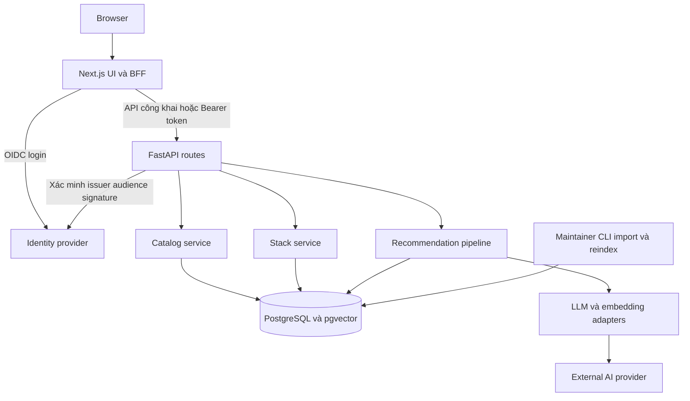
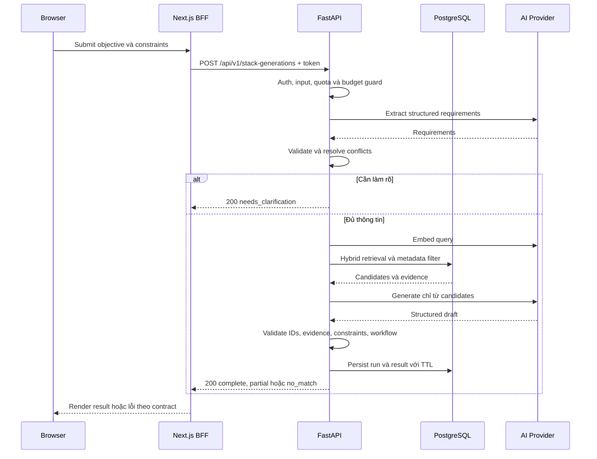

# System architecture

Ngày 28/09/2026 · Thiết kế MVP, chưa có deployment. Scope theo [PRD](../product/PRD.md); trạng thái quyết định tại [ADR](../planning/DECISIONS.md).

## 1. Phương án và ranh giới

Baseline được chấp nhận từ brief: Next.js, FastAPI, PostgreSQL/pgvector, API-based AI và một recommendation pipeline. Đề xuất triển khai: modular monolith backend, BFF session trên Next.js, OIDC, CLI import và một backend instance ban đầu. TASK-001 chốt Auth0 Free + Google Login và Gemini Developer API (gemini-3.5-flash-lite; gemini-embedding-2, D=1536). Versions được pin trong TASK-002; hosting/budget deploy ở TASK-025. Runtime chỉ có Gemini adapter thật; unit/CI cô lập network bằng injected transport, còn live smoke cần API key và opt-in rõ ràng.

| Thành phần | Trách nhiệm | Không sở hữu |
|---|---|---|
| Next.js UI | Search/filter URL, form, states, tool pages, stack editing | Secrets AI, quyết định hard constraints |
| Next.js BFF | OIDC callback/session, chuyển tiếp token tới API, chống CSRF | Catalog business rules, truy cập DB trực tiếp |
| FastAPI | Pydantic contract, auth, owner checks, quota, transactions | Session UI, renderer |
| Catalog service | Public records, keyword/filter, detail, provenance | Tự sinh facts từ LLM |
| Recommendation service | Extract → retrieve → filter → generate → validate | Tự sửa dữ liệu đã biên tập |
| Stack service | Lưu result snapshot, CRUD private, version conflict | Tự tuyên bố stack sửa tay còn verified |
| PostgreSQL | Facts, relations, ownership, run metadata, embeddings | Secrets provider |
| Maintainer import CLI | Dry-run, validate nguồn, upsert, reindex | Public admin API hoặc crawler |

Một codebase backend với module boundaries đủ cho 100–150 tools và nhóm nhỏ. Không tách microservices; không dùng queue infrastructure cho request MVP. CLI reindex thủ công tránh worker thường trực; khi catalog lớn hoặc latency đo được không đạt mới xem xét ADR mới.

## 2. Luồng recommendation

Diagram mô tả happy path và clarification; timeout/provider failure trả lỗi theo [API](API_DESIGN.md). Không có vòng lặp agent tự gọi tools vô hạn. Tối đa một repair call trong deadline/budget còn lại.

## 3. Authentication và authorization — ADR-007 Accepted

OIDC identity provider thực hiện login; Next.js dùng session cookie `HttpOnly`, `Secure` trên HTTPS và `SameSite=Lax`. Token để gọi backend lưu server-side trong session phù hợp adapter; không lưu access token ở localStorage. FastAPI xác minh signature qua JWKS có cache/rotation, issuer, audience, expiry; map `(issuer, subject)` tới UUID user nội bộ. Không tin owner_id hoặc role client gửi.

Browser gọi BFF cùng origin cho thao tác authenticated; mutations kiểm tra CSRF token và Origin. BFF chuyển tiếp access token; API vẫn tự xác minh và lọc `owner_id=current_user.id` ở mọi truy vấn stack/run. Ngoài public catalog routes, không có anonymous mutation. CORS allowlist không thay thế authentication. Login callback chỉ cho phép return path nội bộ, tránh open redirect.

MVP dùng Auth0 Free + Google Login đã chốt TASK-001; kiểm chứng tenant và token đúng audience trong TASK-016. Backend không tự xây password storage hay password reset. API `/me` cung cấp thông tin user tối thiểu; đăng xuất kết thúc session tại BFF. Chính sách logout/revocation theo provider đã chọn cần test.

## 4. Data flow và cập nhật catalog

Maintainer biên tập file curated có stable IDs và nguồn chính thức → CLI dry-run → review → transaction import facts/evidence → đánh dấu embedding cũ → CLI reindex records thay đổi → publish. Runtime AI không ghi facts catalog. Catalog read dùng published records; saved stack giữ snapshot để không mất ngữ cảnh khi tool bị archived.

Mỗi recommendation lưu catalog revision, prompt/pipeline version và embedding model key để tái hiện. Giá/capability là facts từ catalog, không bổ sung bằng kiến thức LLM. Chi tiết freshness và indexing ở [Data model](DATA_MODEL.md).

## 5. Lỗi, quota và chi phí

- Error envelope chung có `code`, `message`, `details`, `request_id`; không lộ stack trace, SQL hoặc provider response thô.
- Input invalid: 422; thiếu identity: 401; tài nguyên không thuộc user: 404; version conflict: 409; quota: 429; provider unavailable: 503; deadline: 504; invalid output sau repair: 502.
- `partial/no_match/needs_clarification` là domain result 200, khác lỗi hệ thống.
- Generation đề xuất giới hạn 5 requests/10 phút/user và 30/ngày/user; cấu hình được; giữ làm default đề xuất, xác nhận trước bật live cùng budget. Quota reservation atomic trong DB, tính cả thất bại có gọi provider. Kiểm soát global inflight bằng một backend instance ban đầu; scale-out phải bổ sung cơ chế admission chung.
- Token/output caps và deadline áp dụng trước external call. Chỉ bật live AI khi có provider tariff và monthly budget cấu hình. Reservation dựa trên upper bound, settlement theo actual usage; vượt budget từ chối trước gọi. Nếu không thể ước lượng an toàn, fail closed với lỗi cấu hình, không giả chi phí bằng 0.
- Retry đọc catalog có backoff ở client; generation không tự retry khi browser không biết server đã gọi provider chưa. Provider retry/repair chia sẻ cùng deadline và call budget.

## 6. Observability và privacy

Logs JSON theo request ID: route/status/duration, pipeline stage, counts candidate/filtered, result status, validator error codes, provider/model identifier, input/output tokens, estimated cost và version. Không raw prompt, raw response, email, access token hoặc secret. User ID trong metrics cần pseudonymize; logs vận hành có quyền truy cập hạn chế.

Đề xuất retention: raw objective chỉ tồn tại trong request memory; generation result đã chuẩn hóa có thể chứa nội dung user nên lưu private 24h rồi purge; logs 14 ngày; metadata vận hành không có result text 30 ngày, giữ lâu hơn nếu còn thuộc tháng budget hiện tại hoặc reservation chưa đối soát như [Data model](DATA_MODEL.md); stack đã lưu đến khi user xóa. Cleanup bằng scheduled CLI/job của nền tảng, không cần Redis. Dữ liệu backup có retention riêng được công bố trước pilot; xóa trên live DB không được hứa là xóa tức thời khỏi backup. Chốt privacy notice và retention với chủ dự án ở TASK-025.

Dashboard đầu tiên chỉ cần số liệu aggregate: latency/error theo route và stage, no_match/partial, token/cost, stale records, failed imports. `/health/live` kiểm tra process; `/health/ready` kiểm tra DB và migration compatibility, không gọi AI trả phí mỗi lần probe.

## 7. Local development

TASK-002 đã scaffold `apps/web`, `apps/api`, `infra/db/init`, scripts PowerShell, Compose và CI. Trên Windows khoảng 8GB RAM: frontend/backend chạy bằng host processes; chỉ PostgreSQL+pgvector chạy trong Docker Compose. Không containerize mọi service mặc định. `data/curated` và `evals` chỉ tạo ở các task sở hữu dữ liệu/evaluation tương ứng. Full Compose profile chỉ xem xét sau khi đo RAM.

Toolchain pin Node.js 22, pnpm 12.6.0, Python 3.11 và lockfiles cho hai hệ sinh thái; bảng phiên bản và lệnh đã kiểm tra nằm trong [README](../../README.md). `.env.example` định nghĩa `DATABASE_URL`, server-only `API_BASE_URL`/`CATALOG_API_TIMEOUT_MS`, OIDC fields, `SESSION_SECRET`, model/embedding identifiers, `GEMINI_API_KEY`, request timeout/output cap, `RUN_LIVE_AI_TESTS` và `AI_MONTHLY_BUDGET_USD`. Các biến secret và FastAPI origin không có prefix public của frontend.

Unit/CI dùng Gemini adapter với injected transport và synthetic response fixtures, không gọi provider hoặc cần API key. Không có fake provider runtime. Live smoke/eval là bước riêng được bật có chủ đích, ghi model/usage/tariff và phát sinh chi phí Gemini thật.

## 8. Deployment và trade-offs

Vercel là một lựa chọn frontend; backend cần hỗ trợ deadline 30s và kết nối DB. Chọn hosting/region theo ngân sách, hỗ trợ pgvector, secret management và data policy. Không khẳng định free tier hoặc pricing nào còn hiệu lực khi chưa kiểm tra.

Pipeline dự kiến: CI lint/type/schema/unit/integration → build → migration có backup → deploy staging → smoke/E2E → release. Migration chạy một lần riêng, không chạy cạnh tranh ở mọi instance. Rollback application phải tương thích schema; ưu tiên migration additive trước destructive change. Trước release thử restore backup và ghi kết quả.

Trade-offs: frontend/backend hai ngôn ngữ tăng công setup nhưng tách UI và AI rõ; exact vector scan đủ cho catalog nhỏ, chưa cần tuning ANN; sync request đơn giản nhưng không hỗ trợ job dài/resume; auth trước Build giảm anonymous conversion nhưng giới hạn abuse/cost. Xem lý do và alternatives trong [Decisions](../planning/DECISIONS.md).
