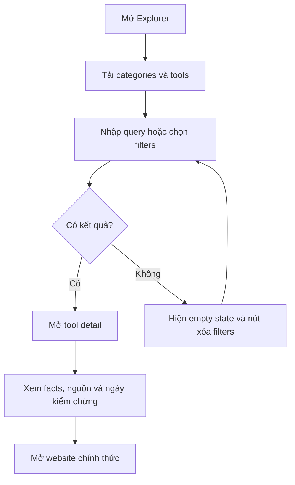
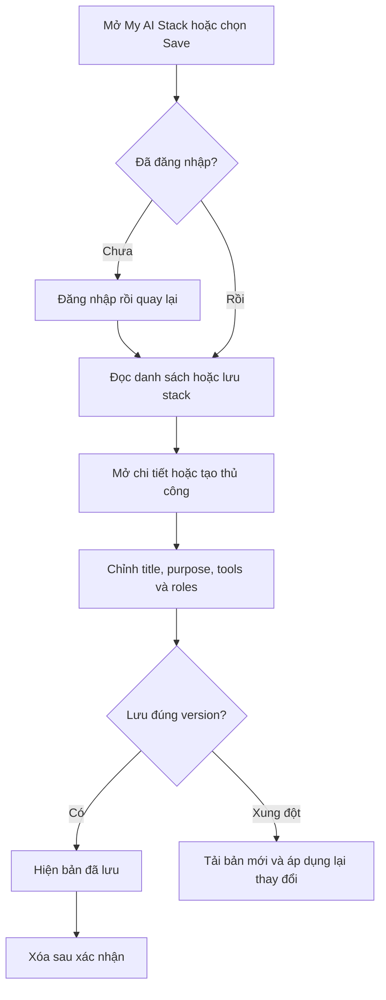

# User flows

Mục đích: xác định hành vi UI cho [PRD](PRD.md), không bổ sung scope. Auth/HTTP theo [API](../architecture/API_DESIGN.md). Tất cả tên màn hình là dự kiến.

## 1. AI Explorer — FR-001 đến FR-003

Entry: trang chủ, đường dẫn `/explorer`, hoặc link tool từ recommendation. Anonymous được phép đọc.

| Tình huống | Hành vi |
|---|---|
| Tìm/lọc | Đồng bộ query vào URL; thay filter reset page=1; debounce input; hủy/ignore response cũ để không đè kết quả mới |
| Thành công | Cards hiển thị tên, description, categories, pricing status; detail liên kết nguồn và website HTTPS |
| Không có kết quả | Giữ query/filters, gợi ý xóa filter; không sinh tool mới để lấp chỗ trống |
| Network/server error | Message có retry; giữ input; request ID để hỗ trợ |
| Tool draft/archived hoặc ID không có | Trang không tìm thấy; link về Explorer; không public nội dung unpublished |
| Dữ liệu unknown/stale | Nhãn chưa biết/cần xác minh lại; không biến unknown thành “không hỗ trợ” |
| Nhiều filters | OR trong category list, AND giữa category/platform/API/pricing; có summary filters đang bật |

Success: người dùng hiểu tool và đến đúng official website. Mở tab ngoài với bảo vệ opener; không proxy URL do user cung cấp qua backend.

## 2. AI Stack Builder — FR-004 đến FR-007

Entry: `/builder`, CTA từ trang chủ/Explorer. Theo ADR-007 đang đề xuất, cần đăng nhập trước request có chi phí AI. Nếu chưa đăng nhập, giữ bản nháp trong session UI và quay về sau login; không gửi prompt cho identity provider.

```mermaid
flowchart TD
    A[Nhập mục tiêu và constraints] --> B[Validate và gửi generation request]
    B --> C{Kết quả}
    C -->|needs_clarification| D[Hiện câu hỏi và cho sửa input]
    D --> B
    C -->|complete hoặc partial| E[Hiện tools, evidence, gaps và workflow]
    C -->|no_match| F[Hiện yêu cầu chưa thỏa và gợi ý sửa]
    F --> A
    C -->|Lỗi kỹ thuật| G[Hiện lỗi và retry có kiểm soát]
    E --> H[Xem tool detail hoặc lưu stack]
```

Main path: user nhập mục tiêu 10–4000 ký tự, có thể nhập OS/RAM/budget/API/offline trong form → UI hiển thị loading và ngăn gửi trùng → backend trả structured response → UI tách rõ facts có evidence và hướng dẫn kết hợp cần kiểm thử.

| Trạng thái/edge case | Phản hồi |
|---|---|
| Input rỗng/quá dài hoặc RAM âm | Chặn bằng field validation; backend cũng validate; không gọi LLM |
| Prompt mâu thuẫn form | `needs_clarification`, hiển thị điểm mâu thuẫn; giữ input để user sửa; gửi lại như request mới, không cần chat nhiều lượt |
| Budget “rẻ” chưa có số hoặc usage chưa rõ | Yêu cầu làm rõ nếu là hard constraint; nếu là preference có thể rank nhưng ghi cost unknown |
| Partial | Hiện các vai trò đã đáp ứng và gaps nổi bật; cho phép lưu có nhãn chưa hoàn chỉnh |
| No match | Không hiện tools vi phạm constraint; chỉ nêu giới hạn và các lựa chọn user có thể chủ động thay đổi |
| Unknown compatibility | Hiển thị bước nối là đề xuất cần kiểm thử; không gắn “tích hợp được xác minh” |
| 429 | Hiện thời gian thử lại từ Retry-After, giữ input |
| Timeout/503/invalid output | Message cụ thể; retry thủ công; không tạo stack cá nhân tự động; không hiển thị output chưa qua validation |
| Reload/đóng trang lúc generate | MVP không có background job/resume; thông báo cần gửi lại, không hứa phục hồi run chưa lưu |
| Tool thay đổi khi user bấm Save | Backend kiểm tra lại publication; trả 409 nếu tool bị rút; yêu cầu generate/chỉnh lại |

Success: user đọc được vai trò, lý do có dẫn nguồn và giới hạn. `complete` chỉ là đủ các roles/constraints theo dữ liệu, không đảm bảo workflow đã chạy thực tế.

## 3. My AI Stack — FR-008 đến FR-010

Entry: nút Save trong result hoặc `/my-stacks`. Chỉ chủ sở hữu có quyền.

Generated save gửi `generation_id` và title; server lấy result đã validate thuộc chính user, không tin “verified” flag từ client. Generation hết hạn sau 24h → 410, yêu cầu tạo lại hoặc lưu thủ công với nhãn unvalidated.

Tạo thủ công cần title, purpose; cho phép 0–20 items để lưu draft. Mỗi item có `item_id`, `tool_id`, `role`, `position`. Có thể dùng một tool cho nhiều roles bằng nhiều items; workflow tham chiếu item IDs. Thay tool giữ item ID nhưng xóa claims/evidence và edges liên quan để tránh dùng chứng cứ cũ.

| Trạng thái/edge case | Hành vi |
|---|---|
| Danh sách trống | CTA tạo thủ công hoặc Build |
| Lưu thành công | Điều hướng chi tiết; refresh đọc cùng version từ server |
| Token hết hạn | Đăng nhập lại; giữ bản nháp trong session UI, không lộ prompt qua redirect URL |
| Truy cập stack người khác | 404 như không tồn tại; không tiết lộ title/owner |
| Hai tab cùng sửa | Version conflict 409; giữ bản nháp, cho tải lại; không âm thầm last-write-wins |
| Sửa thành phần/role/workflow | `validation_state=modified`; nhắc cần kiểm chứng lại, không tự gọi LLM có phí |
| Tool saved nay archived | Vẫn đọc snapshot trong stack của mình với warning; không thêm mới tool archived |
| Xóa item có edges | Xóa edges liên quan trong cùng transaction; UI cho xem thay đổi trước lưu |
| Xóa stack | Dialog xác nhận; thành công quay về list; retry delete của bản đã xóa trả 404, UI có thể coi là đã vắng mặt |

Mọi màn hình có labels, keyboard focus, loading/error announcements; không dùng màu làm cách duy nhất phân biệt complete/partial/modified.
